  

<h2 align="center">About Me</h2>

  I'm Muh Rheivandy from Indonesia. 
  I build useful web experiences, study cybersecurity, and enjoy turning system requirements into clear solutions.

  <code>Junior Cybersecurity</code>
  &nbsp;·&nbsp;
  <code>Fullstack Developer</code>
  &nbsp;·&nbsp;
  <code>System Analyst</code>

<h2 align="center">Technologies</h2>

  
  
  
  
  
  
  
   
  
  
  
  
  
  
  

<h2 align="center">Statistics</h2>

  
  

 

  

