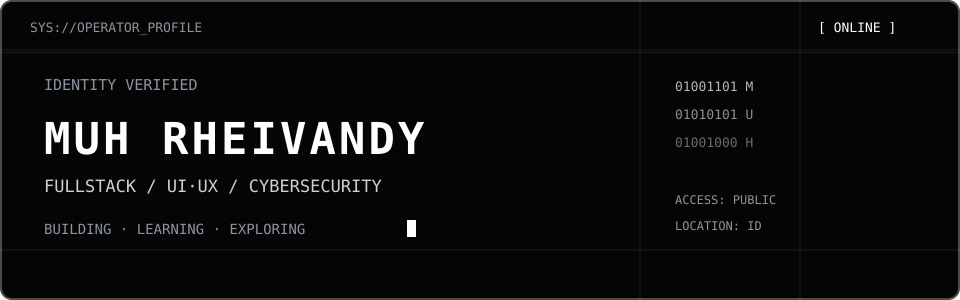

<div align="center">
  
</div>

<h1 align="center">Muh Rheivandy</h1>

<p align="center">
  Fullstack Developer · UI/UX Designer · Cybersecurity Enthusiast<br />
  <sub>Indonesia — available for learning and collaboration</sub>
</p>


## `01 / ABOUT`

I build modern web experiences where code and design work as one. Currently exploring fullstack development, thoughtful interfaces, and cybersecurity fundamentals.

```text
[ BUILDING ] an interactive personal portfolio
[ LEARNING ] cybersecurity fundamentals
[ OPEN     ] collaboration and interesting projects
```

## `02 / STACK`

```text
WEB      HTML · CSS · JavaScript · TypeScript
         React · Next.js · Tailwind · Framer Motion

SERVER   Node.js · Express.js
DATA     MySQL · PostgreSQL · MongoDB

DESIGN   Figma
TOOLS    Git · GitHub · VS Code · Vercel
LAB      Linux · Networking · Web Security
```

## `03 / SELECTED WORK`

**`RHEI.PORTFOLIO`** — Interactive personal portfolio blending editorial design, retro computing, and smooth motion.<br />
`Next.js / TypeScript / Tailwind / Framer Motion`<br />
[Repository](https://github.com/MuhRheivandy/rhei-portfolio) · Private development · `PORTFOLIO_DEMO_URL`

<!-- Replace PORTFOLIO_DEMO_URL with the real portfolio demo URL -->

**`TUMBUH`** — Restaurant and café platform for menus, orders, and daily operations.<br />
Concept / development · `RESTAURANT_REPOSITORY_URL` · `RESTAURANT_DEMO_URL`

<!-- Replace RESTAURANT_REPOSITORY_URL with the real repository URL -->
<!-- Replace RESTAURANT_DEMO_URL with the real demo URL -->

**`QUALITY.LOG`** — Academic implementation and software testing project.<br />
[Repository](https://github.com/MuhRheivandy/IMPLEMENTASI-DAN-PENGUJIAN-PERANGKAT-LUNAK) · Academic project

## `04 / ACTIVITY`

<div align="center">
  <a href="https://github.com/MuhRheivandy?tab=overview">
    
  </a>
</div>

<p align="center"><sub>Public GitHub activity only. Language totals are not a measure of proficiency.</sub></p>

## `05 / CONNECT`

<!-- Replace PORTFOLIO_URL with the real portfolio URL -->
<!-- Replace LINKEDIN_URL with the real LinkedIn URL -->
<!-- Replace INSTAGRAM_URL with the real Instagram URL -->
<!-- Replace EMAIL_ADDRESS with the real email address -->

<p align="center">
  <a href="PORTFOLIO_URL"><code>[ PORTFOLIO ]</code></a>
  &nbsp;
  <a href="LINKEDIN_URL"><code>[ LINKEDIN ]</code></a>
  &nbsp;
  <a href="INSTAGRAM_URL"><code>[ INSTAGRAM ]</code></a>
  &nbsp;
  <a href="mailto:EMAIL_ADDRESS"><code>[ EMAIL ]</code></a>
</p>

<div align="center">
  
  <code>SESSION ACTIVE // KEEP BUILDING _</code>
</div>
