<div align="center">
  
</div>

```text
┌────────────────────────────┐
│  M U H   R H E I V A N D Y │
└────────────────────────────┘
[ SYSTEM BOOT ] identity verified
[ ACCESS      ] granted
[ SESSION     ] ready
```

<h1 align="center">Hello, I'm Muh Rheivandy</h1>

<p align="center">
  Fullstack Developer · UI/UX Designer · Cybersecurity Enthusiast
</p>

<p align="center">
  I build digital solutions, design meaningful experiences,<br />
  and continuously learn to grow.
</p>

<div align="center">
  
</div>

<p align="center"><sub>Fullstack Developer · UI/UX Designer · Cybersecurity Enthusiast · Problem Solver · Tech Explorer</sub></p>


## `01 // IDENTITY FILE`

| Field | Operator record |
|:--|:--|
| **Name** | Muh Rheivandy |
| **Class** | Fullstack Developer |
| **Secondary class** | UI/UX Designer |
| **Specialization** | Cybersecurity Enthusiast |
| **Location** | Indonesia |
| **Current status** | Building, learning, and exploring. |
| **Mission** | Create useful digital products and meaningful user experiences. |

## `02 // SYSTEM PROFILE`

I build modern websites and web applications, with a strong interest in the thinking behind thoughtful UI/UX. I enjoy turning unclear problems into simple, useful experiences and exploring new technology along the way.

Right now, I am developing an interactive personal portfolio and learning cybersecurity fundamentals. I am always open to learning with others, exchanging ideas, and collaborating on interesting projects.

## `03 // CURRENT MISSION`

```text
STATUS : ONLINE              MODE  : LEARNING
FOCUS  : BUILDING

[ACTIVE]    Building an interactive personal portfolio
[LEARNING]  Cybersecurity fundamentals
[EXPLORING] Modern fullstack web development
[IMPROVING] UI/UX and software engineering skills
[OPEN]      Collaboration and learning opportunities
```

## `04 // TECH ARSENAL`

<sub>FRONTEND MODULES</sub><br />


<sub>BACKEND MODULES</sub><br />


<sub>DATA MODULES</sub><br />


<sub>DESIGN MODULE</sub><br />


<sub>TOOLS + DEPLOYMENT</sub><br />


<sub>CYBERSECURITY LEARNING</sub>

`Linux` · `Networking` · `Web Security`

## `05 // FEATURED MISSIONS`

### `RHEI.PORTFOLIO` — Personal Portfolio

An interactive personal portfolio combining modern editorial design, retro computing, gaming UI, and smooth animations.

- **Stack:** Next.js · TypeScript · Tailwind CSS · Framer Motion
- **Repository:** [MuhRheivandy/rhei-portfolio](https://github.com/MuhRheivandy/rhei-portfolio) *(may be unavailable while private)*
- **Status:** Private Development
- **Live demo:** `PORTFOLIO_DEMO_URL`

<!-- Replace PORTFOLIO_DEMO_URL with the real portfolio demo URL -->

### `TUMBUH` — Restaurant and Cafe Platform

A platform concept designed to help restaurants and cafés manage digital menus, customer orders, and business operations.

- **Stack:** To be documented
- **Repository:** `RESTAURANT_REPOSITORY_URL`
- **Status:** Concept / Development
- **Live demo:** `RESTAURANT_DEMO_URL`

<!-- Replace RESTAURANT_REPOSITORY_URL with the real repository URL -->
<!-- Replace RESTAURANT_DEMO_URL with the real demo URL -->

### `QUALITY.LOG` — Software Testing Implementation

An academic software implementation and testing project focused on validation, testing processes, and application quality.

- **Stack:** See repository documentation
- **Repository:** [IMPLEMENTASI-DAN-PENGUJIAN-PERANGKAT-LUNAK](https://github.com/MuhRheivandy/IMPLEMENTASI-DAN-PENGUJIAN-PERANGKAT-LUNAK)
- **Status:** Academic Project
- **Live demo:** Not provided

## `06 // SYSTEM TELEMETRY`

<div align="center">
  <a href="https://github.com/MuhRheivandy?tab=overview">
    
  </a>
</div>

<p align="center">
  <a href="https://github.com/MuhRheivandy?tab=repositories">Browse public repositories</a>
  ·
  <a href="https://github.com/MuhRheivandy?tab=overview">View native contribution history</a>
</p>

<p align="center"><sub>Telemetry reflects public GitHub activity. Repository language totals, when shown by GitHub, do not indicate proficiency or expertise.</sub></p>

## `07 // CYBER LAB`

Currently studying:

- Linux fundamentals
- Computer networking
- Web security fundamentals
- Security awareness
- Ethical cybersecurity practices

> All cybersecurity learning is intended for ethical, educational, and defensive purposes.

## `08 // COMMAND TERMINAL`

```console
$ operator --identity
Muh Rheivandy // Indonesia

$ mission --current
Build useful products. Design with intent. Learn continuously.

$ channel --status
Available for learning, collaboration, and interesting projects.
```

## `09 // OPEN CHANNELS`

<!-- Replace PORTFOLIO_URL with the real portfolio URL -->
<a href="PORTFOLIO_URL"></a>
<!-- Replace LINKEDIN_URL with the real LinkedIn profile URL -->
<a href="LINKEDIN_URL"></a>
<!-- Replace INSTAGRAM_URL with the real Instagram profile URL -->
<a href="INSTAGRAM_URL"></a>
<!-- Replace EMAIL_ADDRESS with the real email address, keeping the mailto prefix -->
<a href="mailto:EMAIL_ADDRESS"></a>

<!-- PORTFOLIO_URL, LINKEDIN_URL, INSTAGRAM_URL, and EMAIL_ADDRESS are intentionally visible placeholders. -->

<br />

<div align="center">
  
  <p>Thanks for visiting my profile.</p>
  <code>&gt; building, learning, and exploring...</code>
  <br /><br />
  <sub>SESSION ACTIVE · CONNECTION SECURE · END OF TRANSMISSION</sub>
</div>
